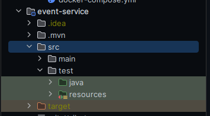
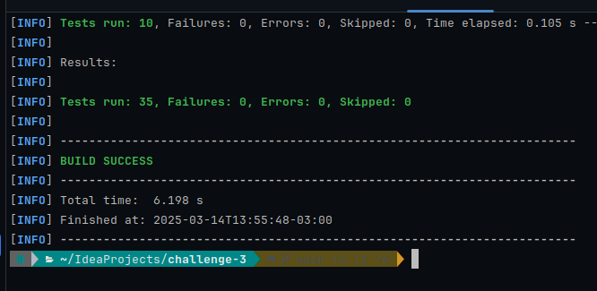
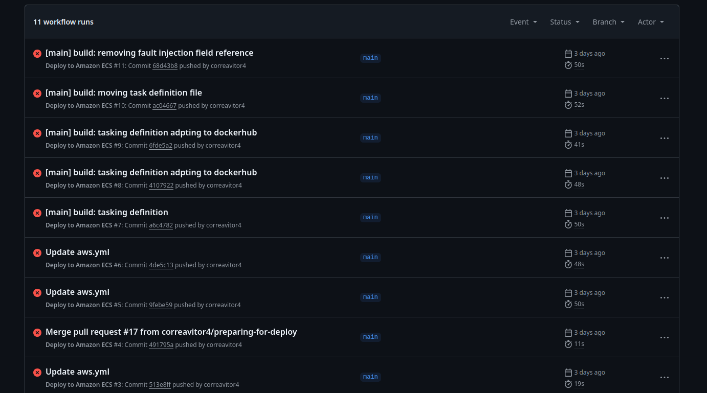

# Desafio 3 - AWS com microsserviços e Spring boot

Esse é um projetos voltado à criação de dois microsserviços: 
1. microsserviço voltado à criação e geranciamento de eventos
2. microsserviço voltado à criação e geranciamento de ingressos

Esses dois se comunicam entre si através de requisições http.

O projeto apresenta as seguintes features:
1. Uso de Open Feign para requisições http
2. DI
3. CI/CD com deploy na AWS em um EC2 através do Beanstalk
4. Docker. Tudo aqui está dockerizado e tratarei disso mais à frente
5. Documentação completa com Swagger
6. teste unitários e de integração


## Como acessar os serviços
Eles estão rodando nos seguintes links:

Event Manager: [Event Manager Swagger docs (use http ao invés de https) ](http://ec2-18-221-149-187.us-east-2.compute.amazonaws.com:8080/swagger-ui/index.html) <br>
Ticket Manager: [Ticket Manager Swagger docs (use http ao invés de https) ](http://ec2-18-221-149-187.us-east-2.compute.amazonaws.com:8081/swagger-ui/index.html)

## Como rodar localmente

Para rodar localmente, é necessário utilizar docker. 

Siga os seguintes passos:
1. Clone o repositório
2. abra o terminal na pasta raiz do projeto e rode o comando: ```docker compose up``` ou ```docker compose up --build```

Nesse momento, o docker irá subir 3 contâineres:
1. Container do serviço Event Manager (porta 8080)
2. Container do serviço Ticket Manager (porta 8081)
3. Container do MongoDB

Você pode testar os serviços pelas próprias documentações do swagger de cada um. Segue abaixo os links
```http://localhost:8080/swagger-ui/index.html```
```http://localhost:8081/swagger-ui/index.html```


## Como rodar os testes
Para rodar os testes, é necessário antes configurar um banco local de teste. Siga as seguintes etapas:
1. Certique-se de que a porta 27017 da sua máquina está livre. Caso tenha rodado a aplicação em localhost via docker-compose, dê um docker compose down antes de seguir para o próximo passo
2. Execute o comando ```docker compose -f "docker-compose/local-test/docker-compose.yml" up   ```. O comando precisa ser exatamente esse. Esse docker compose em específico foi feito para rodar o banco de dados para testes. Você também pode, opcionalmente, rodar o mongo no seu próprio SO, mas terá que configurar antes.

Agora você já está apto a rodar os testes. Existem duas maneiras.

### 1 Rodando pelo Intellij
Basta clicar com botão direito nessa pasta "java": <br>
. <br>
Em seguida, clique em Run Tests Java
Faça o mesmo para o serviço de ms-ticker-manager.

### 2 Rodando via terminal
1. Testes do Event Manager Service: ```./event-service/mvnw -f event-service/pom.xml test```
2. Testes do Ticket Manager Service: ```./ms-ticket-manager/mvnw -f ms-ticket-manager/pom.xml test```
Os resultados serão mais ou menos esses:



## Sobre o Deploy
Inicialmente, tentei rodar com o Github action, mas descobri que nossa conta da AWS bloqueia isso. Sendo assim, tive que buscar outra ferramenta, e usei o Beanstalk e o CodePipeline da própria AWS
1. Configurei o Beanstalk para subir uma instância EC2 t2.small (1 vCPU e 2 GB de memória)
2. Configurei o CodePipeline para iniciar o deploy assim que algo for mergeado na main. Ele sobre a aplicação diretamente para a instânica EC2.

Essa instância EC2 está rodando 3 containers:
1. Container do serviço Event Manager (porta 8080)
2. Container do serviço Ticket Manager (porta 8081)
3. Container do MongoDB

Agora, basta acessar o link da instância EC2 e tudo estar pronto!


## ⚠️Avisos
### Tentativas fracassadas de deploy
Como citei anteriormente, eu tentei fazer o deploy com o Github Actions em uma ECS e usando o ECR para salvar as imagens.
Sendo assim, é possível ver que existem vários pipelines que falharam: <br>
<br>
